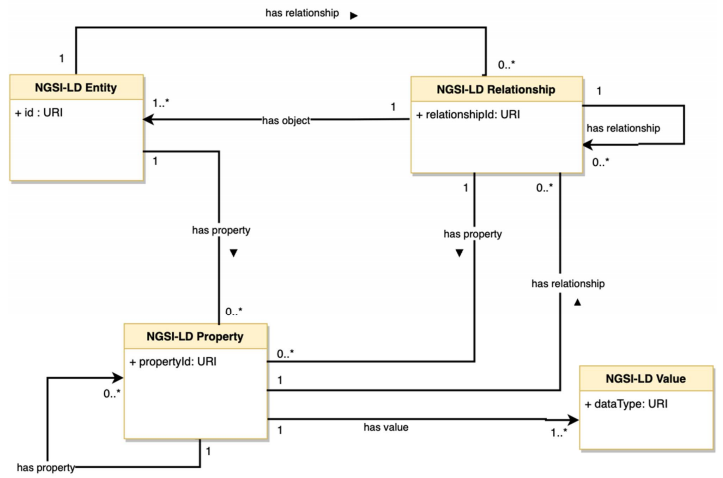

# NGSI-LD library
PyNgsild is a library to communicate/integrate simply with a FIWARE Context Broker using the [NGSI-LD API](https://www.etsi.org/deliver/etsi_gs/CIM/001_099/009/01.04.01_60/gs_CIM009v010401p.pdf).
## Concepts
The library defines Classes for each element of the NGSI-LD data model, namely:
* **Entity**,
* **Property**,
* **Relationship**.



Then, a **ContextBroker** Class implements the NGSI-LD operations (e.g. Create Entity). The current implementation supports:
* *Create Entity*,
* *Partial Attribute update*,
* *Delete Entity*,
* *Retrieve Entity*,
* *Query Entities*
## How To
#
### Create an entity
A simple entity can be created with:
```python
from pyngsild.entity import Entity

entity_1 = Entity(id='uri:entity_id', type='entity_type')
```
Then, the NGSI-LD context of this entity can be set with:
```python
entity_1.at_context = 'https://my/context'
```
#
### Create a property
A simple property could be created with:
```python
from pyngsild.proprel import Property

property_1 = Property(name='property_name', value='property_value')
```
A complete property could be created with:
```python
property_2 = Property(name='property_name', value='property_value',
                       observed_at='some_date_time', unit_code='a_unit_code',
                       datasetid='uri:prop:datatsetid')
```
It is then easy to add a property to an entity:
```python
entity_1.add(property_1)
```
#
### Create a relationship
It really follows the same principle as **Property** (with obviously different type of attributes). For instance, to create relationship:
```python
from pyngsild.proprel import Relationship

relationship_1 = Relationship(name='relationship_name', object_='to:uri:object',
                         observed_at='some_date_time',
                         datasetid='uri:rel:datasetid')
```
a property can be added to a relationship:
```python
relationship_1.add(property_2)
```
And a relationship can be added to a property:
```python
property_1.add(relationship_1)
```
At this stage, the **entity_1** has a property **property_1**, which has a **relationship_1**, which has a property **property_2**.

The NGSI-LD json representation of this entity can be simply displayed with:
```python
print(entity_1.to_ngsild())
```
#
### Context Broker
Operations to a NGSI-LD Context Broker are supported through the ContextBroker Class. For instance, creating an entity into a Context Broker is simply done with:
```python
from pyngsild.ctxbroker import ContextBroker

ctxb = ContextBroker('https://my/context/broker')
headers = {'Authorization': 'Bearer the_token', 
           'Content-Type': 'application/ld+json'}
response = ctxb.create_entity(request_headers=headers, entity=entity_1)
```
#
## Installation
```bash
pip install git+https://{token}@github.com/stellio-hub/pyngsild
```
